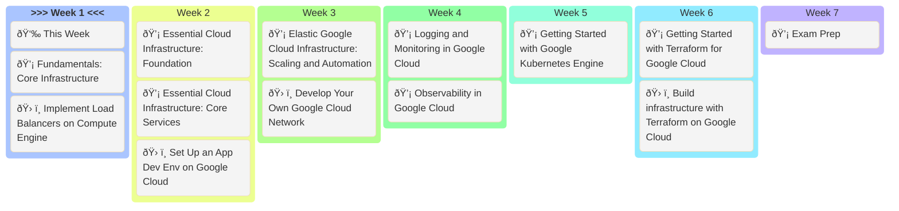

# Training Schedule

```mermaid
%%{init: {'theme': 'base'}}%%
kanban
    **>>> Week 1 <<<**
        👉 This Week
        💡 Fundamentals: Core Infrastructure
        ðŸ› ï¸ Implement Load Balancers on Compute Engine

    Week 2
        💡 Essential Cloud Infrastructure: Foundation
        💡 Essential Cloud Infrastructure: Core Services
        ðŸ› ï¸ Set Up an App Dev Env on Google Cloud

    Week 3
        💡 Elastic Google Cloud Infrastructure: Scaling and Automation
        ðŸ› ï¸ Develop Your Own Google Cloud Network

    Week 4
        💡 Logging and Monitoring in Google Cloud
        💡 Observability in Google Cloud

    Week 5
        💡 Getting Started with Google Kubernetes Engine

    Week 6
        💡 Getting Started with Terraform for Google Cloud
        ðŸ› ï¸ Build infrastructure with Terraform on Google Cloud

    Week 7
        💡 Exam Prep
```
