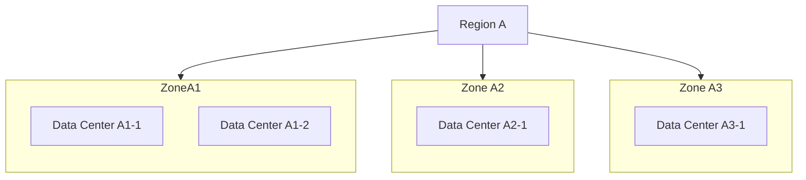
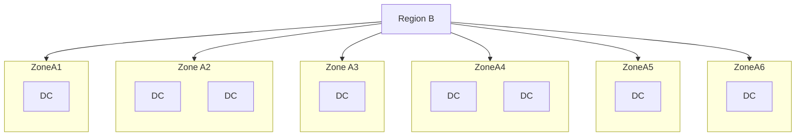

# Global Infrastructure

- Regions & Zones (availability, latency)
- Importance of High Availability (HA)
- Geographic redundancy

<!-- 
Highlight the importance of selecting regions and zones to reduce latency, improve performance, and achieve redundancy.
-->

---
layout: image
image: /regions-maps_2x.png
---

<!--
Regions, Zones, Data Centres
-->

---

- 3 to 6 zones per region
- 1+ Data Centres per zone

