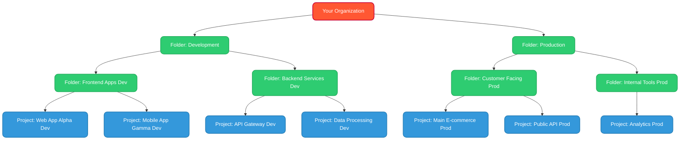

# VPC Networking

---
zoom: 0.95
---

# Custom VPCs vs. Default VPC

* **Default VPC Network:**
  * Created automatically when the Compute Engine API is enabled in a new project.
  * Named `default`.
  * **Auto-mode:** Automatically creates subnets in each GCP region with predefined, non-overlapping RFC 1918 IP ranges (e.g., `10.120.0.0/20`, `10.124.0.0/20`, etc.).
  * Comes with pre-configured firewall rules (e.g., allow RDP, SSH, ICMP from anywhere).
  * **Pros:** Easy to get started, no initial network configuration needed.
  * **Cons:** Less control over IP ranges (can lead to overlap if peering), predefined firewall rules might be too permissive for production.
* **Custom VPC Network:**
  * You manually create the VPC network and its subnets.
  * **Custom-mode:** You define the IP CIDR ranges for each subnet.
  * **No default firewall rules** (except the implicit deny ingress/allow egress). You must explicitly create rules.
  * **Pros:** Full control over IP addressing scheme, enhanced security by starting with a deny-all ingress posture.
  * **Cons:** Requires more upfront planning and configuration.

---

# Custom VPCs vs. Default VPC

* **Recommendation:**
  * Use the `default` VPC for learning, experimentation, or very simple setups.
  * For **production environments**, it is strongly recommended to create **Custom VPC networks** to ensure control over IP ranges (avoiding conflicts with on-premises or other peered networks) and to implement a deliberate security posture with firewall rules.
  * You can convert an auto-mode VPC to custom-mode, but you cannot convert custom-mode to auto-mode.

---

# Subnet IP Addressing - Primary Ranges

* **CIDR (Classless Inter-Domain Routing) Notation:**
  * Defines an IP address range (e.g., `10.1.0.0/20`).
  * The `/20` indicates the number of bits in the network prefix.
  * A `/20` range has `32 - 20 = 12` host bits, allowing for `2^12 = 4096` IP addresses.
* **Primary IP Range:**
  * The main IP address range assigned to a subnet.
  * VMs in the subnet get their primary internal IP from this range.
  * Plan ranges carefully to avoid overlap with other subnets in the same VPC or peered VPCs.
  * Allow for future growth.
* **Expanding Primary CIDR Ranges:**
  * You can expand the primary IP range of a subnet *after creation* (e.g., change `/20` to `/19`).
  * Expansion must not overlap with other subnets in the same VPC in that region.
  * You cannot shrink a CIDR range.

---

# Subnet IP Addressing - Secondary Ranges

* **Secondary IP Ranges (Alias IP Ranges):**
  * Allows you to assign multiple IP address ranges to a single subnet.
  * VMs can then have IP addresses from these secondary ranges assigned to their network interfaces (as alias IPs).
  * **Use Cases:**
    * Running multiple services on a VM, each with its own IP.
    * Hosting containers (e.g., Google Kubernetes Engine pods) where each pod needs its own IP address from a dedicated range.
    * Migrating from on-premises with existing IP schemes.

---

# Subnet IP Addressing - Reserved IPs

* **Reserved IP Addresses in a Subnet:**
  * In any subnet primary range, Google Cloud reserves **four IP addresses**:
    1. Network address (e.g., `10.1.0.0` for `10.1.0.0/20`)
    2. Gateway address (typically the first usable address, e.g., `10.1.0.1`)
    3. Second-to-last address (reserved for future use)
    4. Broadcast address (e.g., `10.1.15.255` for `10.1.0.0/20`)
  * This means a `/20` range has `4096 - 4 = 4092` usable IP addresses for VMs.

---
zoom: 0.9
---

# Routes - System-Generated

* **What are Routes?** Rules that define paths for network traffic leaving resources (like VMs) within your VPC network. They tell packets where to go next based on their destination IP address.
* **Route Table:** Each VPC network has an associated, distributed route table. Routes are automatically applied to resources.
* **System-Generated Routes:**
  * **Default Internet Route:**
    * Destination: `0.0.0.0/0`
    * Next hop: `Default internet gateway`
    * Priority: `1000`
    * Allows traffic from VMs (with external IPs or using Cloud NAT) to reach the internet.
  * **Subnet Routes:**
    * Automatically created for each subnet in the VPC.
    * Destination: The IP CIDR range of the subnet.
    * Next hop: The VPC network itself (meaning traffic is delivered directly within the subnet).
    * Allows resources within the same VPC to communicate directly using internal IPs.

---
zoom: 0.9
---

# Routes - Custom Static Routes

* **Custom Static Routes:**
  * Manually created routes to define specific paths for traffic.
  * **Components:**
    * Destination IP range (CIDR).
    * Priority (lower number = higher priority, evaluated before system routes if more specific or higher priority).
    * Next hop:
      * Specific VM instance (by name or IP) - e.g., for a Network Virtual Appliance (NVA).
      * Internal IP address (for internal load balancers).
      * VPN tunnel (for traffic to on-premises).
      * Classic VPN gateway / HA VPN gateway.
      * VPC Network Peering connection.
  * **Use Cases:**
    * Directing traffic to an NVA (firewall, IDS/IPS).
    * Forcing traffic destined for specific on-premises ranges through a VPN tunnel.
    * Overriding parts of the default internet route for specific destinations.
    * Creating more specific routes than the default subnet routes.

---
zoom: 0.75
---

# Dynamic Routing with Cloud Router

* **What is Cloud Router?** A fully managed Google Cloud service that uses the Border Gateway Protocol (BGP) to exchange routes dynamically between your VPC network and your on-premises network or other cloud networks.
* **How it Works:**
  * Cloud Router itself doesn't forward traffic; it programs routes into your VPC network based on BGP advertisements.
  * It peers with your on-premises BGP router (via Cloud VPN or Cloud Interconnect).
* **Key Features & Benefits:**
  * **Automatic Route Propagation:** No need to manually configure static routes for on-premises networks. Cloud Router learns them via BGP and installs them in the VPC.
  * **VPC Subnet Advertisement:** Cloud Router advertises your VPC subnet ranges to your on-premises network.
  * **Redundancy & Failover:** If you have redundant VPN tunnels or Interconnects, Cloud Router can manage failover by detecting BGP session failures and withdrawing routes.
  * **Custom Route Advertisements:** You can control which VPC IP ranges are advertised (e.g., specific custom ranges, not just subnet ranges).
* **Use with:**
  * **Cloud VPN:** Essential for HA VPN to enable dynamic routing and failover.
  * **Cloud Interconnect (Dedicated & Partner):** Standard way to exchange routes.
* **Configuration:**
  * Create a Cloud Router in the same region as your VPN gateway or Interconnect attachment.
  * Configure a BGP session with your peer router, specifying Google's ASN (16550) and your ASN.
* **Autonomous System Number (ASN):** A unique number that identifies a network under a single administrative domain for BGP. You'll need one for your on-premises network.

---

# Firewall Rules - Advanced Targeting

* **Recap of Core Components:**
  * **Direction:** `Ingress` (incoming) or `Egress` (outgoing).
  * **Action:** `Allow` or `Deny`.
  * **Source/Destination Filters:** IP CIDR ranges.
  * **Protocols & Ports:** e.g., `tcp:80`, `udp:53`, `icmp`.
  * **Priority:** `0` (highest) to `65535` (lowest).
* **Advanced Target Specification:**
  * **Network Tags:** Arbitrary string labels applied to VM instances. Rules can target VMs with specific tags (e.g., `web-server`, `database-server`). Simple and flexible.
  * **Service Accounts:** Apply rules to VMs based on the service account they are running as.
    * More secure and manageable than tags for identity-based rules, as service accounts are IAM principals.
    * Cannot be as easily mis-assigned or typos as tags.

---

# Firewall Rules - Logging

* **Firewall Rules Logging:**
  * When enabled on a firewall rule, connection attempts that match the rule (both allowed and denied, depending on configuration) are logged to Cloud Logging.
  * Provides visibility into traffic patterns, helps troubleshoot connectivity issues, and aids in security auditing.
  * Can generate significant log volume, so enable judiciously. (Think COST)

---

# Firewall Rules - Hierarchy

* **Hierarchical Firewall Policies (Organization/Folder Level):**
  * Allows security administrators to define consistent firewall policies at the Organization or Folder level.
  * These policies can explicitly deny traffic or allow traffic, and can be configured to take precedence over project-level VPC firewall rules.
  * Helps enforce baseline security across multiple projects.

 
 

