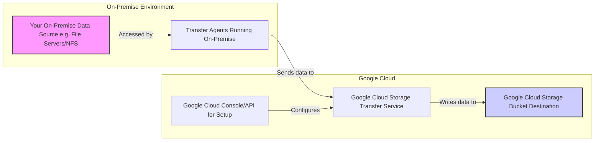

# Cloud Storage

---

# Bucket Naming

* **Bucket Naming (Recap):**
  * Must be **globally unique** across all of Google Cloud.
  * Adhere to DNS naming conventions (lowercase, numbers, hyphens, dots; no leading/trailing dots/hyphens).
  * Example: `my-company-app-prod-backups-unique123`

---
zoom: 0.9
---

# Bucket Locations - Impact

* **Region:**
  * Data stored redundantly across zones *within* that single region (e.g., `us-central1`).
  * Lowest latency for users/apps *in or near* that region.
  * SLA: Typically 99.9% or 99.95% (check current docs).
  * Cost: Baseline storage cost for that region.
* **Dual-region:**
  * Data stored redundantly across zones in *two specific, pre-defined regions* (e.g., `nam4` which is `us-central1` and `us-east1`).
  * Low latency access from both regions and high availability if one region becomes unavailable.
  * SLA: Typically 99.95% or 99.99%.
  * Cost: Higher than single-region storage, but lower than multi-region for the same data.
* **Multi-region:**
  * Data stored redundantly across zones in *multiple regions* within a large geographic area (e.g., `US`, `EU`, `ASIA`).
  * Highest availability against regional outages. Lowest latency for users spread across that continent/area.
  * SLA: Typically 99.99% or 99.995%.
  * Cost: Highest storage cost per GB.

---

# Location Choice

* **Choosing a Location:**
  * Consider where your users/applications are.
  * What are your availability requirements (protection against zonal vs. regional outage)?
  * What is your budget?
  * Data sovereignty or regulatory requirements might dictate location.

---

# Signed URLs

* **What are Signed URLs?** Time-limited URLs that provide temporary access to a specific Cloud Storage object, even if the object is private.
* **How they Work:**
  * An identity with appropriate permissions (e.g., a service account with `roles/storage.objectViewer` for downloads, or the `iam.serviceAccounts.signBlob` permission) generates a cryptographic signature for a specific object, HTTP method, and expiration time.
  * This signature is embedded in the URL.
  * When a user accesses the URL, Cloud Storage validates the signature and expiration.
* **Components of a Signed URL (Simplified):**
  * Bucket and Object path.
  * Expiration timestamp.
  * Signature.
  * Google Access ID (of the signer).
* **Supported HTTP Methods:** `GET` (download), `PUT` (upload), `DELETE`, `HEAD`.

---

# Signed URLs

* **Generation:**
  * Using client libraries (Python, Java, Node.js, etc.).
  * Using `gsutil signurl` command.
* **Security Considerations:**
  * **Short Expiration Times:** Grant access for the minimum necessary duration.
  * **HTTPS:** Always use HTTPS to protect the URL in transit.
  * **Protect the Signer:** The ability to generate signed URLs is powerful. Secure the service account keys or user credentials that have signing permissions.
  * **Principle of Least Privilege:** The signer should only have permissions for the intended action
* **Use Cases:**
  * Allowing users to download their private files (e.g., invoices, reports) from your application.
  * Enabling users to upload files directly to a private bucket from a web browser.
  * Securely delivering software updates or large media files.
  * Temporary access for external collaborators.

---

# Object Versioning

* **What is Object Versioning?** A bucket-level setting, when enabled, keeps a history of object modifications. Each overwrite or deletion of an object creates a new version or a noncurrent (archived) version.
* **Enabling Versioning:**
  * Can be enabled on a bucket at any time. Cannot be disabled once enabled (but can be suspended).
  * `gsutil versioning set on gs://BUCKET_NAME`
* **How it Works:**
  * Each object version is identified by its name and a unique **generation number**.
  * The most recent version is the **live version**.
  * When you overwrite a live object: The existing live version becomes a **noncurrent version**, and the new content becomes the new live version.
  * When you delete a live object (without specifying a generation): The live version becomes a **noncurrent version** (it's not truly deleted from storage immediately).
  * To permanently delete an object, you must delete its specific generation or all its versions (or use lifecycle rules).

---

# Object Versioning

* **Accessing Versions:**
  * Live version: Accessed by default using the object name.
  * Noncurrent versions: Accessed by specifying the object name and its generation number.
* **Restoring Noncurrent Versions:**
  * Copy the noncurrent version to become the new live version.
  * Delete the current live version (which makes the latest noncurrent version effectively live if no other live version exists, though copying is more explicit).
* **Use Cases:**
  * **Protection against accidental deletion:** Easily recover deleted objects.
  * **Protection against accidental overwrites:** Revert to a previous version of an object.
  * **Audit trail / History:** Maintain a history of changes to objects.
* **Cost Implications:** Noncurrent versions incur storage costs at the same rate as live versions based on their storage class. Use Lifecycle Management to manage the retention of noncurrent versions.

---

# Uniform Bucket-Level Access (UBLA)

* **The Problem UBLA Solves:**
  * Historically, Cloud Storage supported two access control systems: IAM and ACLs (Access Control Lists).
  * ACLs can be applied to individual objects, leading to complex, fine-grained permissions that can be hard to manage and audit, potentially conflicting with bucket-level IAM.
  * This dual system can be confusing and lead to unintended access configurations.
* **What is Uniform Bucket-Level Access?**
  * A bucket-level setting that **disables ACLs** for all objects in the bucket.
  * When enabled, access control is solely managed by **IAM permissions** applied at the bucket or project/folder/org level.
  * This simplifies permission management and aligns Cloud Storage with how most other GCP services handle access control.

---

# Uniform Bucket-Level Access (UBLA)

* **Benefits of UBLA:**
  * **Simplicity:** Only one system (IAM) to manage and understand.
  * **Consistency:** Access control works like other GCP services.
  * **Easier Auditing:** Simpler to determine who has access to what.
  * **Prevents ACL-based "surprises":** Eliminates the risk of an object ACL granting unintended access that bypasses IAM policies.
* **Enabling UBLA:**
  * Can be set during bucket creation or enabled on an existing bucket.
  * If enabling on an existing bucket with ACLs, review existing ACLs as they will no longer be effective.
* **Recommendation:**
  * **Enable Uniform Bucket-Level Access for all new buckets.**
  * Consider migrating existing buckets to UBLA for improved security posture and manageability.
  * Only use ACLs if you have a very specific legacy use case requiring per-object permissions that cannot be achieved with IAM conditions (which are becoming more powerful).

---

# Requester Pays

* **Standard Billing Model:** By default, the **bucket owner** pays for:
  * Storage costs of the data.
  * Network egress (data download) costs.
  * Operation costs (e.g., GET, PUT requests).
* **What is Requester Pays?**
  * A bucket-level setting that shifts the cost of **network egress and operation charges** to the **requester** of the data, rather than the bucket owner.
  * The bucket owner still pays for storage costs.
* **Use Cases:**
  * **Sharing large datasets:** Make large datasets (e.g., scientific data, public domain archives) available without the bucket owner incurring all the download costs.
  * **Service providers:** Offer data access where consumers pay for their own usage.

<!--
* **Considerations:**
  * Not suitable for all scenarios (e.g., serving a typical website where you want to cover user download costs).
  * Users must be aware that they need to specify a billing project.
  * Anonymous access is not possible with Requester Pays (as a billing project is needed).
-->

---

# Data Loading: Command-Line Upload to Cloud Storage (`gsutil`)

* **`gsutil` Tool:** The primary command-line tool for interacting with Google Cloud Storage. Part of the Cloud SDK.
* **Common Upload Scenarios:**
  * Uploading individual files.
  * Uploading entire directories.
  * Synchronizing directories.
* **Basic Upload Command (`gsutil cp`):**
  * Copies files/directories from a source to a destination.
  * `gsutil cp [LOCAL_FILE_PATH] gs://[BUCKET_NAME]/[OBJECT_PATH]`
  * `gsutil cp -r [LOCAL_DIRECTORY_PATH] gs://[BUCKET_NAME]/[DESTINATION_PATH_PREFIX]` (recursive for directories)

---

# `gsutils` examples

* **Example: Uploading a single file:**
  * `gsutil cp my-report.csv gs://my-company-data-lake/reports/my-report.csv`
* **Example: Uploading a directory:**
  * `gsutil cp -r ./local-images/ gs://my-website-assets/images/`
* **Key `gsutil cp` Flags for Uploads:**
  * `-r` (recursive): Essential for copying directories.
  * `-m` (multi-threaded/multi-processing): Performs operations in parallel
* **`gsutil rsync` for Synchronization:**
  * Makes the destination match the source, only copying changed or new files. Efficient for regular updates.
  * `gsutil rsync -r [LOCAL_DIRECTORY_PATH] gs://[BUCKET_NAME]/[DESTINATION_PATH_PREFIX]`
  * Can also delete files at the destination that are not at the source (use with `-d` flag and caution).
* **Permissions:** The identity running `gsutil` (user or service account) needs appropriate IAM permissions on the target bucket (e.g., `roles/storage.objectCreator` or `roles/storage.objectAdmin`).

---

# From Cloud Storage into Big Query

Cloud Storage often acts as a staging area or data lake, from which data is loaded into other GCP services for processing, analysis, or serving.

* **Loading into BigQuery:**
  * **Common Use Case:** Batch loading data for analytics and data warehousing.
  * **Supported Formats:** CSV, JSON (newline-delimited), Avro, Parquet, ORC.
  * **Methods:**
    * **Cloud Console:** UI for creating load jobs.
    * **`bq load` command-line tool:**
            `bq load --source_format=CSV --skip_leading_rows=1 mydataset.mytable gs://mybucket/data.csv schema.json`
    * **Client Libraries:** Programmatically initiate load jobs (Python, Java, etc.).
    * **Federated Queries:** Query data in Cloud Storage directly without loading (for some formats), though loading is often better for performance on repeated queries.
  * **Schema Detection:** BigQuery can often auto-detect schema for supported formats.
---

# From Cloud Storage into Cloud SQL

* **Loading into Cloud SQL:**
  * **Common Use Case:** Importing data into managed MySQL, PostgreSQL, or SQL Server instances.
  * **Methods:**
    * **Import from Cloud Storage:**
      * For MySQL/PostgreSQL: Import SQL dump files (`.sql`) or CSV files.
      * For SQL Server: Import BAK files (from Cloud Storage).
      * Managed through Cloud Console or `gcloud sql import ...` commands.
    * **Database Migration Service (DMS):** For more complex migrations, including continuous replication from on-premises or other clouds.

---

# From Cloud Storage into Compute Instance or K8s

* **Compute Engine Instances:**
  * Applications running on VMs can directly access data from Cloud Storage using:
    * `gsutil` (e.g., in a startup script).
    * Cloud Storage Client Libraries within the application code.
    * Cloud Storage FUSE (mounts a bucket as a file system - use with caution for performance-sensitive apps).
* **Google Kubernetes Engine (GKE) Pods:**
  * Similar to Compute Engine, applications in containers can use client libraries or `gsutil` (if included in the container image) to access data from Cloud Storage.
  * Service accounts with appropriate GCS permissions should be used (Workload Identity recommended).
* **Key Benefit of Staging in GCS:** Decouples data ingestion from processing, provides a durable and cost-effective landing zone.

---

# Storage Transfer Service - Overview

* **What is Storage Transfer Service?** A fully managed, high-performance service for transferring large amounts of data *into* Google Cloud Storage, *between* Cloud Storage buckets, or *from* other cloud providers (AWS S3, Azure Blob Storage, HTTP/HTTPS sources).
* **Key Features:**
  * **Managed Transfers:** Google manages the transfer infrastructure, parallelism, and retries. No servers to set up or manage.
  * **Scalability & Performance:** Designed for terabytes to petabytes of data. Optimizes transfers for speed.
  * **Scheduling:** One-time transfers or recurring scheduled transfers (e.g., daily, weekly).
  * **Filtering:** Include/exclude objects based on prefixes, modification times, or specific object lists.
  * **Data Integrity:** Performs data integrity checks during and after transfer.
  * **Notifications:** Cloud Pub/Sub notifications on transfer completion or failure.
  * **Logging:** Integrates with Cloud Logging for transfer monitoring.

---

# Storage Transfer Service - Use Cases

* **Common Use Cases:**
  * **Migrating data from on-premises storage to Cloud Storage:** (Requires an on-premises agent for file system transfers).
  * **Migrating data from other cloud providers (AWS S3, Azure Blob) to Cloud Storage.**
  * **Backing up data from one Cloud Storage bucket to another** (use native replication if possible).
  * **Archiving data** by moving it from active buckets to archival storage classes in different buckets.
  * **Ingesting data from public HTTP/HTTPS sources** (e.g., public datasets).
* **Transfer Types:**
  * **Cloud Storage to Cloud Storage:** Between buckets (can be different projects, locations, storage classes).
  * **AWS S3 to Cloud Storage.**
  * **Azure Blob Storage / Data Lake Storage Gen2 to Cloud Storage.**
  * **HTTP/HTTPS List of URLs to Cloud Storage.**
  * **File System to Cloud Storage (On-Premises Transfer):** Requires installing transfer agents on your on-premises servers.

---

# Storage Transfer Service - from on-premise

